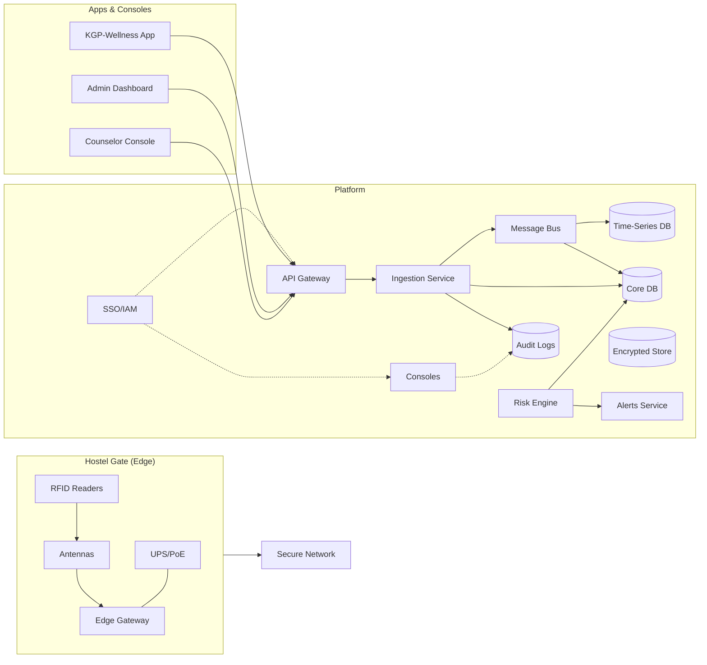

<section class="page-hero">
  <p class="hero-eyebrow">Pilot proposal · IIT Kharagpur</p>
  <h1>KGP-Wellness brings caring, real-time visibility to hostel life.</h1>
  <p class="hero-lede">Pair RFID gate data with a 30-second voluntary mood check-in so wardens, counselors, and student mentors can spot distress early and respond with empathy, not surveillance.</p>
  <div class="stat-grid">
    <div class="stat-card">
      <strong>600</strong>
      Students in first hostel pilot
    </div>
    <div class="stat-card">
      <strong>10 weeks</strong>
      Structured rollout, feedback, and tuning
    </div>
    <div class="stat-card">
      <strong>&lt; 30 sec</strong>
      Average time for a daily check-in
    </div>
  </div>
  <div class="hero-tags">
    <span class="hero-tag">RFID attendance</span>
    <span class="hero-tag">Daily well-being trends</span>
    <span class="hero-tag">Consent-driven outreach</span>
    <span class="hero-tag">Privacy-by-design</span>
  </div>
</section>

## 1. Executive Snapshot

### The challenge
- Academic pressure and isolation are leading indicators of crises in residential campuses.
- Current attendance logs surface compliance, not well-being; support teams often learn about distress after escalation.

### Our proposal
- Pilot KGP-Wellness in one hostel (~600 residents) to merge **RFID-powered occupancy** with a **mobile/PWA check-in** that nudges students gently.
- Deploy a **risk engine with human oversight** that highlights sustained low mood, large drops, or silence while respecting student consent.
- Provide **role-based dashboards** so administration views anonymised trends and muster data while counselors see flagged students only when consented or during emergencies.

### Outcomes for administration
- Live hostel occupancy (muster-ready) with health of edge devices.
- Weekly mood trends and participation rates to inform proactive interventions.
- Documented SOPs so wardens and counselors coordinate within 24 hours of urgent flags.

### Outcomes for students
- A safe space to note mood, sleep, and request a call; quick links to campus and national helplines.
- Positive nudges to build routine and resilience, with human mentors reaching out only when needed.
- Transparency: students pick their privacy settings, audit who contacted them, and can opt out.

<div class="callout">
  <strong>Care over compliance:</strong> the pilot is designed with the Counseling Center and student representatives. Participation is voluntary, but rewarded through wellness streaks, peer credits, and community programming.
</div>

## 2. Daily Journey (Pilot Hostel)

1. **Arrival / Exit** – Student taps their RFID card at the hostel gate. Low-latency edge logic updates live occupancy, deduplicates rapid taps, and syncs to campus systems.
2. **Daily Check-in (PWA / kiosk reminders)** – Students receive a gentle reminder between 7–10 pm; a 1–5 mood scale, optional sleep hours, and free-text reflection take under 30 seconds.
3. **Risk Engine Review (nightly)** – EWMA mood, streaks, large drops, and behaviour signals (late exits + low mood, withdrawal, silence) are recomputed. Scores only escalate when patterns persist.
4. **Response Playbooks** –
   - **Tier 1:** The app delivers self-care nudges and curated resources.
   - **Tier 2:** With consent, counselors/peer mentors schedule a check-in call within 24 hours.
   - **Tier 3:** Urgent alerts reach the Counseling Center and warden hotline for immediate outreach.
5. **Dashboards & Governance** – Wardens see occupancy, device status, and aggregate sentiment; counselors see individual alerts alongside audit logs and consent context.

> Students keep ownership of their story. No academic or disciplinary body sees individual check-ins without explicit consent or a Tier-3 escalation protocol signed off by the Dean (SW).

## 3. Operating Principles & Governance

- **Privacy by design:** Purpose-limited data flows, short retention (RFID 90 days, check-ins 180 days), encryption at rest and in transit, and third-party security reviews.
- **Informed consent:** Students choose whether counselors can view their entries; emergency pathways are separately documented and auditable.
- **Human-in-the-loop:** Algorithms only prioritise; trained staff initiate every conversation, log outcomes, and close the loop with students.
- **Well-being incentives:** House events, recognition boards, and mentor credits encourage voluntary participation without penalties.
- **Transparent oversight:** Multi-stakeholder steering committee (Dean SW, Counseling Center, student representatives) meets bi-weekly during the pilot.

## 4. Pilot Timeline & Investment

| Phase | Weeks | Focus |
| --- | --- | --- |
| Governance & ethics | 1–2 | Approvals, privacy review, communication plan, hostel orientation |
| Instrumentation | 3–4 | Install RFID readers + antennas, edge SBC with UPS, networking checks |
| Platform build | 3–5 | APIs, data stores, student PWA, anonymised admin dashboards |
| Risk engine & counselor console | 5–6 | Feature engineering, thresholds, consent workflows |
| Live pilot | 7–8 | Student onboarding, comms, daily monitoring, rapid feedback loops |
| Tune & scale-ready playbook | 9–10 | Threshold calibration, SOP refinements, costings for expansion |

**Estimated pilot investment (INR)**

| Item | Budget range |
| --- | --- |
| RFID readers, antennas, cabling | ₹2.5 – 3.5 L |
| Edge SBC, UPS, networking | ₹0.5 – 0.8 L |
| Software platform, dashboards, risk engine | ₹3 – 5 L |
| Security, ethics, training, communications | ₹0.5 – 1 L |
| **Total (pilot hostel)** | **₹6.5 – 10 L** |

## 5. Platform Overview

### Edge instrumentation
- **RFID cards:** HF (ISO/IEC 14443-A, MIFARE DESFire EV2) or UHF (ISO/IEC 18000-63 / EPC Gen2v2).
- **Readers per gate:** Two HF readers or 1–2 UHF reader + antenna assemblies with ≥30 reads/sec throughput.
- **Edge gateway:** Raspberry Pi 4 / industrial SBC with Docker runtime, offline cache, MQTT + HTTPS publish, watchdog service.
- **Power & connectivity:** PoE switch with UPS and remote health pings.

### Platform & data services
- **APIs:**
  - `POST /v1/rfid/events`
  - `POST /v1/app/checkins`
  - `GET /v1/hostels/{id}/occupancy/live`
  - `GET /v1/wellness/trends`
- **Datastores:** PostgreSQL (core), TimescaleDB (events), Redis (session/cache), encrypted object store for journaling.
- **Data retention & anonymisation:** Automated purge policies, consent-aware exports for research partnerships.

### Dashboards & workflows
- **Admin / Warden:** Live occupancy, muster status, device uptime, incident logs.
- **Well-being trends:** Hostel-level weekly median mood, participation streaks, low-mood day percentages.
- **Counselor console:** Alert inbox with context, call notes, follow-up scheduling, and audit trails.

## 6. Appendices (for Technical Review)

### 6.1 Risk engine feature sketch

Signals include EWMA mood, consecutive low scores, large drops, late-night exits, withdrawal markers, and silence despite prior engagement. Features feed a transparent scoring rubric that maps to Tier 1–3 responses.

### 6.2 Pseudocode (occupancy + nightly risk)

```python
# Real-time Occupancy
ANTIPASSBACK_WINDOW = 20

def on_rfid_event(evt):
    if is_duplicate(evt.student_id, evt.direction, evt.ts, ANTIPASSBACK_WINDOW):
        return
    last_state = get_last_presence(evt.student_id)
    if evt.direction == 'in' and last_state != 'in':
        increment_hostel_occupancy(evt.hostel_id)
        set_presence(evt.student_id, 'in', evt.ts)
    elif evt.direction == 'out' and last_state != 'out':
        decrement_hostel_occupancy(evt.hostel_id)
        set_presence(evt.student_id, 'out', evt.ts)
    cache_event(evt)

# Nightly Risk Calculation
ALPHA = 0.3

def compute_features(student_id, asof):
    moods = get_moods(student_id, days=30, asof=asof)
    s_ewma = ewma([m for _, m in moods], alpha=ALPHA, start=3.0)
    last14 = [m for d, m in moods if d >= asof - days(14)]
    today_mood = mood_on(student_id, asof)

    low_streak = consecutive_days(student_id, lambda m: m <= 2, asof)
    drop_flag = today_mood and len(last14) >= 5 and (today_mood - median(last14) <= -2)

    late_exit_flag = count_between(get_exits(student_id, 7), "23:30", "02:00") >= 2
    withdrawal_flag = (weekly_exits(student_id, 7) < 2 and low_mood_days(student_id, 7) >= 2)
    silence_flag = was_regular(student_id) and not any_checkins(student_id, 10)

    save_risk_features(
        student_id,
        asof,
        s_ewma,
        mean(last14),
        stddev(last14),
        low_streak,
        late_exit_flag,
        withdrawal_flag,
        silence_flag,
    )

def nightly_alerts(asof):
    for s in all_students():
        f = load_features(s.id, asof)
        severity, reasons = 0, []
        if f.low_streak >= 3:
            severity += 2
            reasons.append("3+ low-mood days")
        if f.silence_flag:
            severity += 2
            reasons.append("silence")
        if f.withdrawal_flag:
            severity += 1
            reasons.append("withdrawal")
        if f.late_exit_flag and f.low_streak >= 1:
            severity += 1
            reasons.append("late exits+low mood")
        if f.ewma_mood <= 2.0:
            severity += 1
            reasons.append("low ewma")
        if drop_in_mood_today(s.id, asof, 2):
            severity += 1
            reasons.append("large drop")

        if severity >= 4:
            create_alert(s.id, "T3", reasons)
        elif severity >= 3 and s.consent_counselor:
            create_alert(s.id, "T2", reasons)
        elif severity >= 1:
            push_app_nudge(s.id, pick_resources(reasons))
```

### 6.3 Architecture diagram


