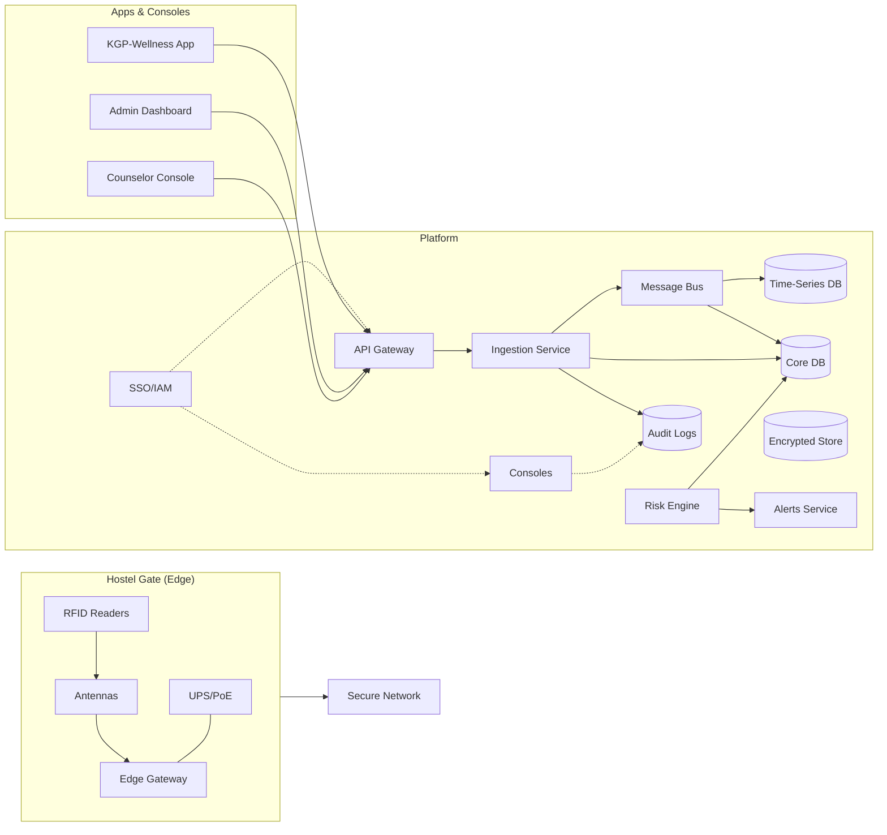

# KGP-Wellness: RFID-Aided Hostel Attendance + Daily Well-Being Check-ins

---

## 1. One-Page Concept Note (for Administration)

**Title:** KGP-Wellness: RFID-Aided Hostel Attendance + Daily Well-Being Check-ins  
**Owner:** MUST Lab (IIT Kharagpur) in partnership with Counseling Center & Dean (SW)

### Problem
- Rising academic stress and isolation in residential campuses demand proactive, privacy-preserving support.
- Attendance systems don’t surface early signs of distress; counseling often engages too late.

### Solution (Pilot in 1 hostel, ~600 students)
- **RFID at hostel gates** records in/out events to produce **live occupancy** (safety/muster) and basic movement patterns.
- **KGP-Wellness App (Web + Android PWA)** prompts a **10–30 sec daily check-in** ("How was your day?" 1–5), optional sleep hours & free-text.
- **Risk Engine (conservative & explainable)** looks only for repeated low mood and large drops; it **never diagnoses**—it simply **nudges** the student or (if consented) notifies a counselor/peer mentor.
- **Dashboards** show **aggregates** to wardens/admin (no individual data by default); counselors see **individuals only with consent** or Tier-3 emergencies.

### Non-Negotiables
- **Care over compliance:** Check-ins are voluntary (incentivized, not forced).  
- **Privacy by design:** Purpose limitation, short retention, opt-out controls, audit logs, role-based access.  
- **Human in the loop:** Trained staff respond; algorithms never act alone.

### What Students Get
- A quick mood tracker, resource finder, crisis helplines, request-a-call, and positive nudges for sleep, routines, and social connection.

### What Institute Gets
- **Real-time hostel occupancy**, **anonymous well-being trends**, early-warning triage (with consent), standard operating procedures for follow-up, and transparent guardrails.

### Pilot Plan (8–10 weeks)
- Weeks 1–2: Governance & ethics approval; finalize hardware layout.  
- Weeks 3–5: Ingestion APIs, DBs, app MVP, anonymized dashboards.  
- Week 6: Risk engine v0 + counselor console.  
- Weeks 7–8: Live pilot (1 hostel), comms & feedback.  
- Weeks 9–10: Threshold tuning, scale playbook.

### Budget (pilot)
- RFID readers + antennas + cabling: ₹2.5–3.5 L  
- Edge SBC + UPS + networking: ₹0.5–0.8 L  
- Software (portal, app, dashboards, risk engine): ₹3–5 L  
- Security/ethics/training/comms: ₹0.5–1 L  
**Total:** ~₹6.5–10 L (marginal cost drops per additional hostel)

### Success Metrics
- ≥70% of residents tap consistently; ≥50% weekly check-in participation;  
- Median counselor **time-to-first-contact** <24h for urgent flags;  
- Strong student acceptance (net satisfaction ≥+30).

---

## 2. Technical Specification (MVP)

### A. Hardware & Edge
- **RFID Cards:** HF (ISO/IEC 14443-A, MIFARE-DESFire EV2) or UHF (ISO/IEC 18000-63 / EPC Gen2v2).  
- **Readers (per hostel main gate):** 2 fixed readers (HF) or 1–2 readers with antennas (UHF). Throughput ≥30 reads/sec.  
- **Edge Gateway:** Raspberry Pi 4 or industrial SBC with Docker runtime, offline cache, MQTT/HTTPS publishing.  
- **Power/Net:** PoE switch + UPS.

### B. Platform & Data
- **APIs:**  
  - `POST /v1/rfid/events`  
  - `POST /v1/app/checkins`  
  - `GET /v1/hostels/{id}/occupancy/live`  
  - `GET /v1/wellness/trends`  
- **Datastores:** PostgreSQL (core), TimescaleDB (events), Redis (cache), Encrypted Object Store.  
- **Schemas:** `students`, `rfid_events`, `checkins`, `risk_features`, `alerts`, `care_actions`.  
- **Privacy:** Retain RFID 90d, check-ins 180d, anonymize for research with consent.

### C. Risk Engine
- Signals: EWMA mood, consecutive low scores, large drops, late-night exits, withdrawal, silence.  
- Tiers: T1 (nudges), T2 (counselor/peer mentor outreach with consent), T3 (urgent counselor contact).

### D. Dashboards
- **Admin/Warden:** Occupancy, device health.  
- **Well-being Trends:** Hostel weekly mood median, low-mood % days.  
- **Counselor:** Alerts, triage, call notes.  

### E. Security
- TLS, AES-256 encryption, RBAC, audit logs, annual third-party audit.

---

## 3. Pseudocode (Occupancy + Risk)

```python
# Real-time Occupancy
ANTIPASSBACK_WINDOW = 20

def on_rfid_event(evt):
    if is_duplicate(evt.student_id, evt.direction, evt.ts, ANTIPASSBACK_WINDOW):
        return
    last_state = get_last_presence(evt.student_id)
    if evt.direction == 'in' and last_state != 'in':
        increment_hostel_occupancy(evt.hostel_id)
        set_presence(evt.student_id, 'in', evt.ts)
    elif evt.direction == 'out' and last_state != 'out':
        decrement_hostel_occupancy(evt.hostel_id)
        set_presence(evt.student_id, 'out', evt.ts)
    cache_event(evt)

# Nightly Risk Calculation
ALPHA = 0.3

def compute_features(student_id, asof):
    moods = get_moods(student_id, days=30, asof=asof)
    s_ewma = ewma([m for _, m in moods], alpha=ALPHA, start=3.0)
    last14 = [m for d, m in moods if d >= asof - days(14)]
    today_mood = mood_on(student_id, asof)

    low_streak = consecutive_days(student_id, lambda m: m <= 2, asof)
    drop_flag = today_mood and len(last14) >= 5 and (today_mood - median(last14) <= -2)

    late_exit_flag = count_between(get_exits(student_id,7), "23:30","02:00") >= 2
    withdrawal_flag = (weekly_exits(student_id,7) < 2 and low_mood_days(student_id,7) >= 2)
    silence_flag = was_regular(student_id) and not any_checkins(student_id,10)

    save_risk_features(student_id, asof, s_ewma, mean(last14), stddev(last14),
                       low_streak, late_exit_flag, withdrawal_flag, silence_flag)

def nightly_alerts(asof):
    for s in all_students():
        f = load_features(s.id, asof)
        severity, reasons = 0, []
        if f.low_streak >= 3: severity += 2; reasons.append("3+ low-mood days")
        if f.silence_flag: severity += 2; reasons.append("silence")
        if f.withdrawal_flag: severity += 1; reasons.append("withdrawal")
        if f.late_exit_flag and f.low_streak >= 1: severity += 1; reasons.append("late exits+low mood")
        if f.ewma_mood <= 2.0: severity += 1; reasons.append("low ewma")
        if drop_in_mood_today(s.id, asof, 2): severity += 1; reasons.append("large drop")

        if severity >= 4: create_alert(s.id, "T3", reasons)
        elif severity >= 3 and s.consent_counselor: create_alert(s.id, "T2", reasons)
        elif severity >= 1: push_app_nudge(s.id, pick_resources(reasons))
```

---

## 4. Architecture Diagram


